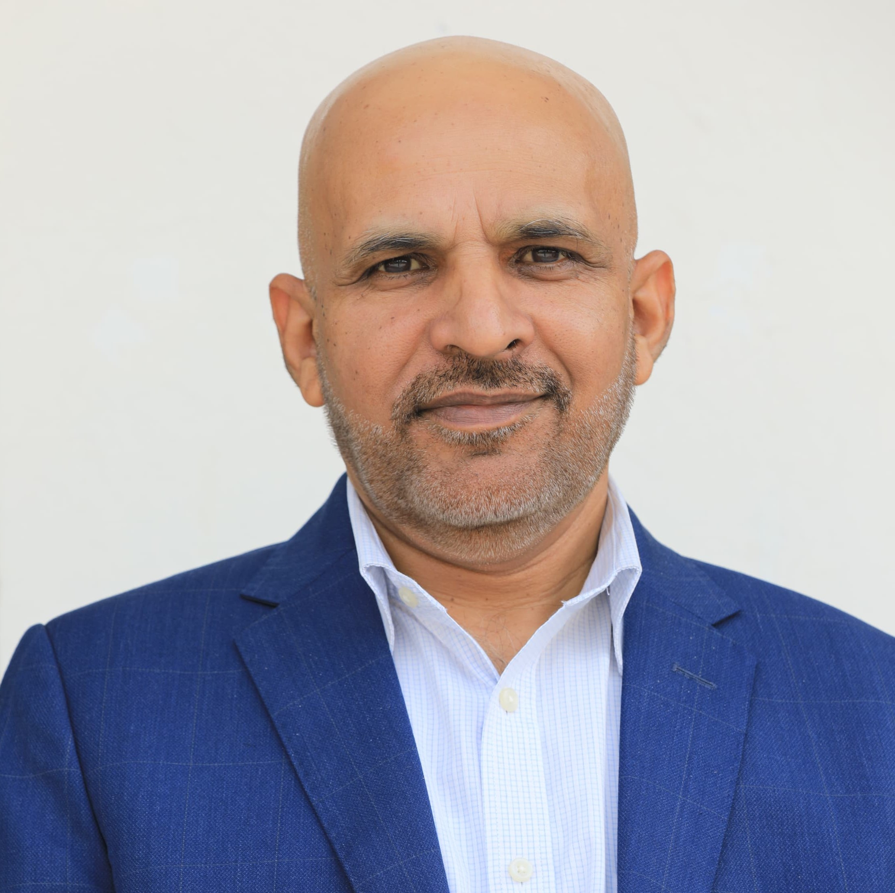

::: {.column-page}

<!-- Hero Section -->
::: {.hero-section}

::: {.grid}
::: {.g-col-12 .g-col-md-8}

## Advancing Economic Measurement, Data Analysis and Analytics, and Evidence-Based Policy for Pakistan {.hero-title}

*Professor of Economics · Ex-Director, School of Economics, Quaid-i-Azam University, Islamabad*

I work at the intersection of economic measurement, data analysis and analytics, and public policy. With over two decades of research, institutional leadership, and hands-on training, my work bridges the gap between how we measure our economy and how we make decisions about it.

I combine rigorous applied econometrics with modern data tools to address Pakistan's most pressing measurement and policy challenges — from measuring economy to automation and digital statistical systems.

[Research →](research.qmd){.btn-primary}
[Policy Writing →](policy.qmd){.btn-secondary}
[Teaching & R Tutorials →](teaching.qmd){.btn-secondary}

:::

::: {.g-col-12 .g-col-md-4}
{.profile-photo fig-alt="Dr. Zahid Asghar - Professor and Director, School of Economics, QAU Islamabad"}
:::

:::
:::

---

<!-- Signature Themes -->

## What I Work On {.section-heading}

::: {.grid}

::: {.g-col-12 .g-col-md-6 .g-col-lg-4}
::: {.theme-card}
### 📊 Economic Measurement & Reform
GDP base-year revision, CPI methodology, national accounts modernization, and measuring Pakistan's evolving digital economy. My [PIDE analysis on GDP measurement](https://pide.org.pk/blog/pending-pakistans-revised-base-estimates-of-gdp-and-measurement-issues-in-lsm/) and [2008 paper on CPI biases](https://www.pide.org.pk/pdf/Volume47/Issue3-2008.pdf) pioneered this conversation in Pakistan.
:::
:::

::: {.g-col-12 .g-col-md-6 .g-col-lg-4}
::: {.theme-card}
### 🤖 AI, Data Governance & Official Statistics
Critical analysis of [Pakistan's National AI Policy](posts/pakistan-ai-policy/index.qmd), digital statistical infrastructure for PBS, and the governance frameworks needed to deploy AI responsibly in public institutions.
:::
:::

::: {.g-col-12 .g-col-md-6 .g-col-lg-4}
::: {.theme-card}
### 📈 Applied Econometrics & Causal Inference
Graph-theoretic approaches to causality, structural modeling, impact evaluation, and machine learning for classification — published in *Taylor & Francis*, *Springer*, *SAGE*, and *Elsevier*.
:::
:::

::: {.g-col-12 .g-col-md-6 .g-col-lg-4}
::: {.theme-card}
### 💻 Data Science for Development
R programming, data visualization, reproducible research, and open-source tools for policy analysts. I teach economists to code and analysts to think critically — with [50+ open-source repositories](https://github.com/zahedasghar).
:::
:::

::: {.g-col-12 .g-col-md-6 .g-col-lg-4}
::: {.theme-card}
### 🏛️ Institutional Leadership
Director of the School of Economics and former Registrar at Quaid-i-Azam University. Member of the [RASTA Research Advisory Committee](https://rasta.pide.org.pk/research-advisory-committee/) for policy-oriented research. Former Chairman, Department of Statistics, QAU. Senior faculty at NIBAF, State Bank of Pakistan.
:::
:::

::: {.g-col-12 .g-col-md-6 .g-col-lg-4}
::: {.theme-card}
### 🎓 Human Capital & Education Reform
Rethinking how Pakistan teaches economics — from textbook memorization to data literacy, critical reasoning, and reproducible research. [Read my piece on higher education reform →](https://pide.org.pk/blog/thinking-beyond-metrics-in-higher-education/)
:::
:::

:::

---

## Featured Work {.section-heading}

::: {.grid}

::: {.g-col-12 .g-col-md-6}
::: {.featured-card}
#### 📝 Pakistan's AI Policy: A Vision Without Teeth
*A critical analysis of Pakistan's National AI Policy 2025 — what it gets right, what it leaves out, and what must change.*

[Read the full essay →](posts/pakistan-ai-policy/index.qmd)
:::
:::

::: {.g-col-12 .g-col-md-6}
::: {.featured-card}
#### 📝 GDP Measurement and LSM Methodology
*Co-authored with Mahmood Khalid at PIDE — on why Pakistan's GDP base-year revision is overdue and how measurement errors distort policy.*

[Read on PIDE →](https://pide.org.pk/blog/pending-pakistans-revised-base-estimates-of-gdp-and-measurement-issues-in-lsm/)
:::
:::

::: {.g-col-12 .g-col-md-6}
::: {.featured-card}
#### 📄 Biases in Consumer Price Index Methodology in Pakistan
*Published in The Pakistan Development Review (2008) — a foundational critique of PBS's CPI methodology with concrete suggestions for improvement.*

[View paper →](https://www.pide.org.pk/pdf/Volume47/Issue3-2008.pdf)
:::
:::

::: {.g-col-12 .g-col-md-6}
::: {.featured-card}
#### 💻 R Tutorials & Open Data Projects
*Applied Econometrics with R, Impact Evaluation tools, Data Visualization, PDF data extraction, Election data analysis — all open source.*

[Explore on GitHub →](https://github.com/zahedasghar)
:::
:::

:::

---

## Roles & Affiliations {.section-heading}

| Role | Institution |
|------|------------|
| Professor & Director | School of Economics, Quaid-i-Azam University, Islamabad |
| Former Registrar | Quaid-i-Azam University, Islamabad |
| Former Chairman | Department of Statistics, Quaid-i-Azam University |
| RAC Member | [RASTA Competitive Grants Program](https://rasta.pide.org.pk/research-advisory-committee/), PIDE |
| Former Senior Faculty | National Institute of Banking & Finance (NIBAF), State Bank of Pakistan |

---

## Stay Connected {.section-heading}

::: {.grid}

::: {.g-col-12 .g-col-md-6}
#### 📬 Newsletter
Subscribe to receive new policy essays, data explorations, and R tutorials.

<!-- Add your newsletter embed here -->
:::

::: {.g-col-12 .g-col-md-6}
#### 🔗 Find Me
- [Google Scholar](https://scholar.google.com.pk/citations?user=ObUvhnsAAAAJ&hl=en)
- [RePEc / IDEAS](https://ideas.repec.org/e/pas57.html)
- [ResearchGate](https://www.researchgate.net/profile/Zahid-Asghar-2)
- [YouTube](https://www.youtube.com/Zahidasghar)
- [LinkedIn](https://linkedin.com/in/zahidasghar)
- [GitHub](https://github.com/zahedasghar)
- [X / Twitter](https://twitter.com/zahedasghar)
:::

:::

:::
